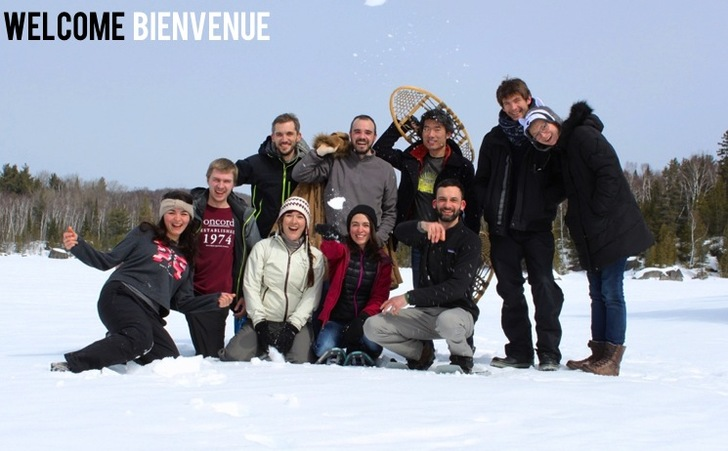
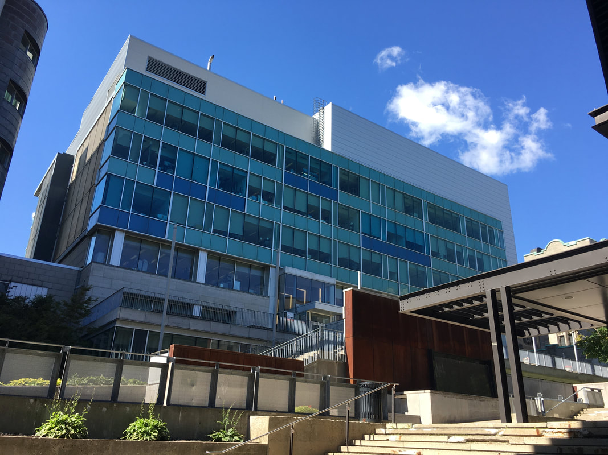
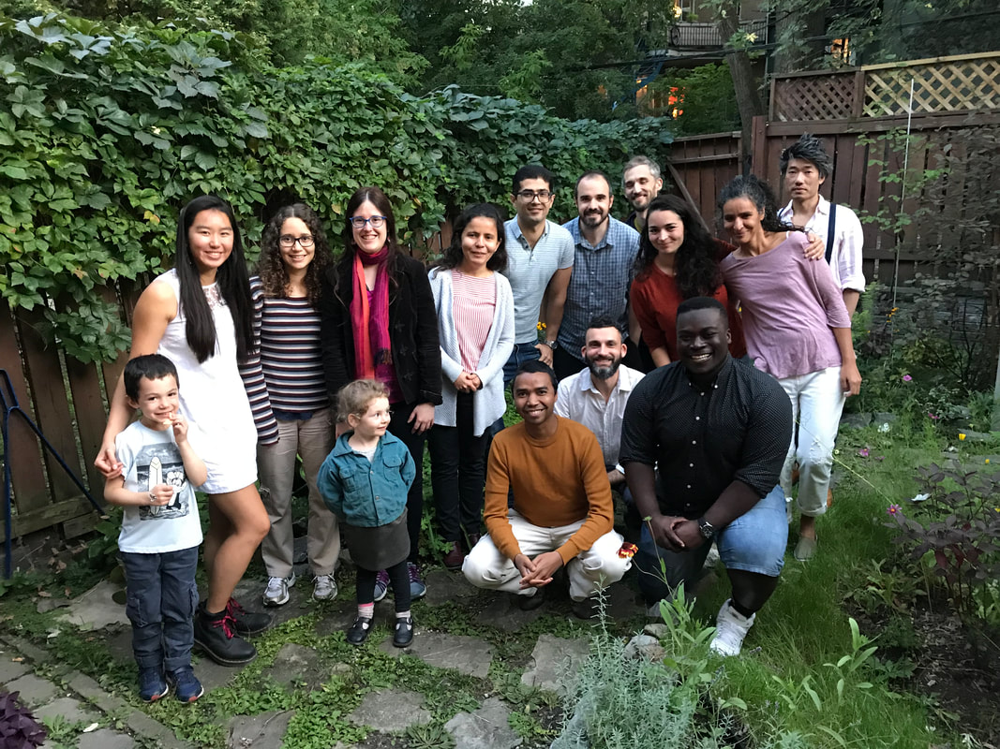
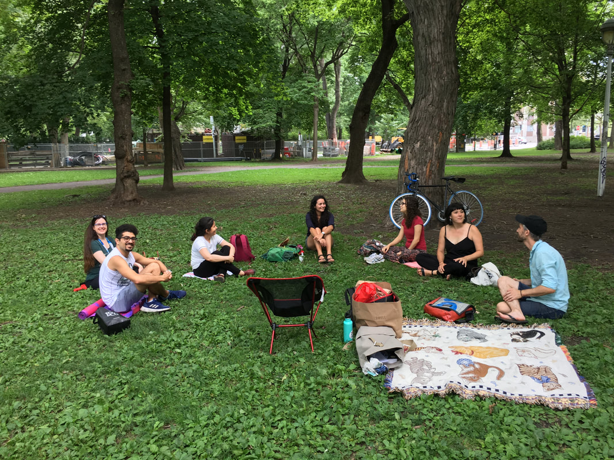
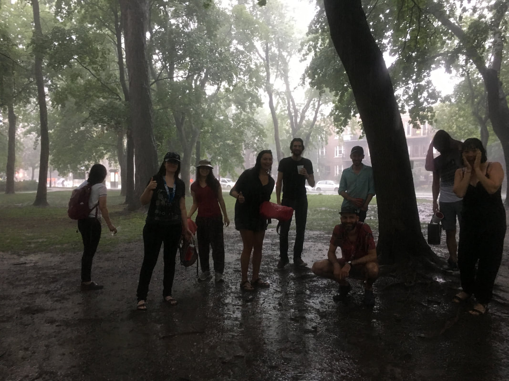

Pardon our appearance; *this website is under construction*!  
 

 
**News** - Spring 2023 

1. Sana's paper "Zooanthroponotic transmission of SARS-CoV-2 and host-specific viral mutations revealed by genome-wide phylogenetic analysis" is also out in [eLife](https://elifesciences.org/articles/83685). Team work by multiple lab members & [Selena Sagan](https://www.saganlab.com/). 
2. Gavin's preprint "Pseudogenes as a neutral reference for detecting selection in prokaryotic pangenomes" is out in [bioRxiv](https://doi.org/10.1101/2023.05.17.541134). Check out his thread about it on [twitter](https://twitter.com/gavin_m_douglas/status/1659555557374656512?s=20).
3. We are thrilled to have [Dr. Aline Cuénod](https://scholar.google.com/citations?user=6OxAByoAAAAJ&hl=en) join the lab!
  

**The lab is located at the [McGill Genome Centre](https://www.mcgillgenomecentre.ca/)** - Stop by and say hi! We have coffee.  

or you might also find us having a bbq or picnic. 
 
  
  
rain or shine...  
