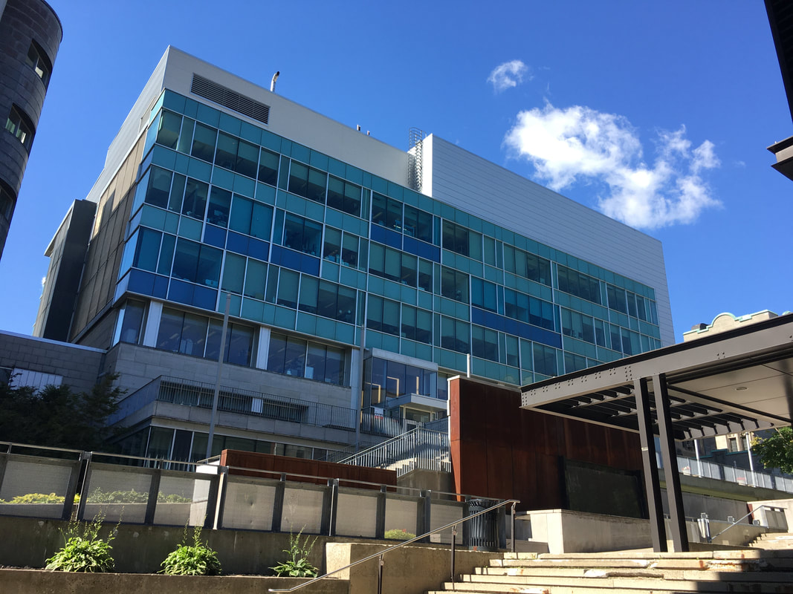
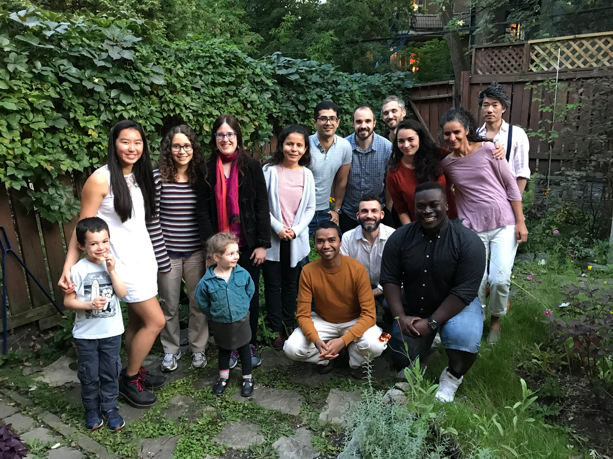
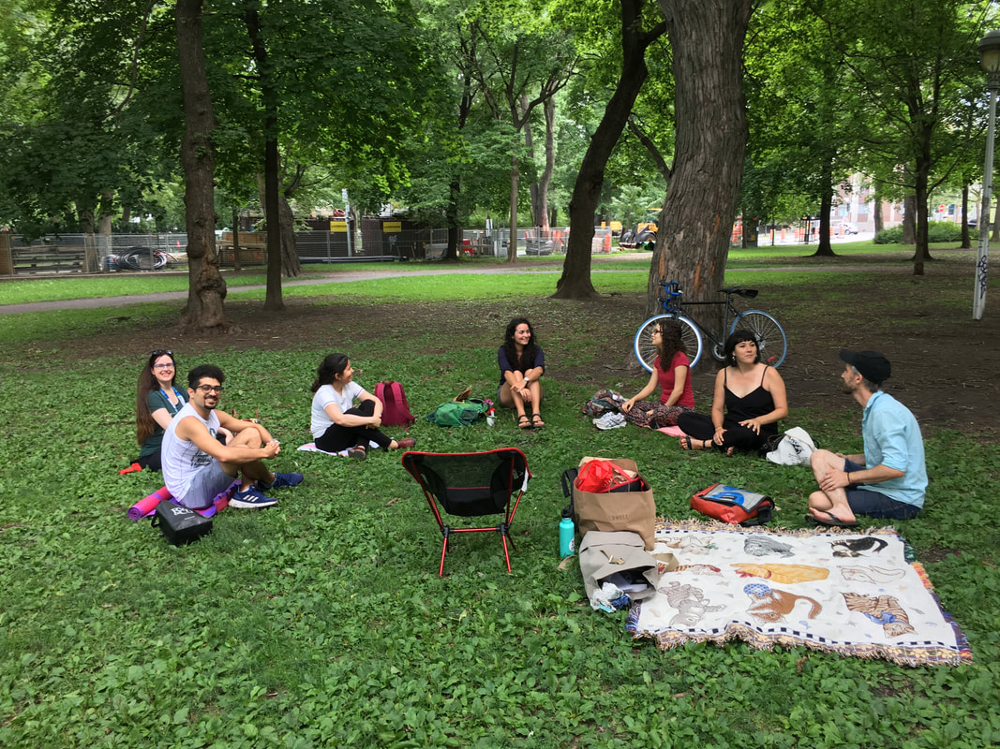
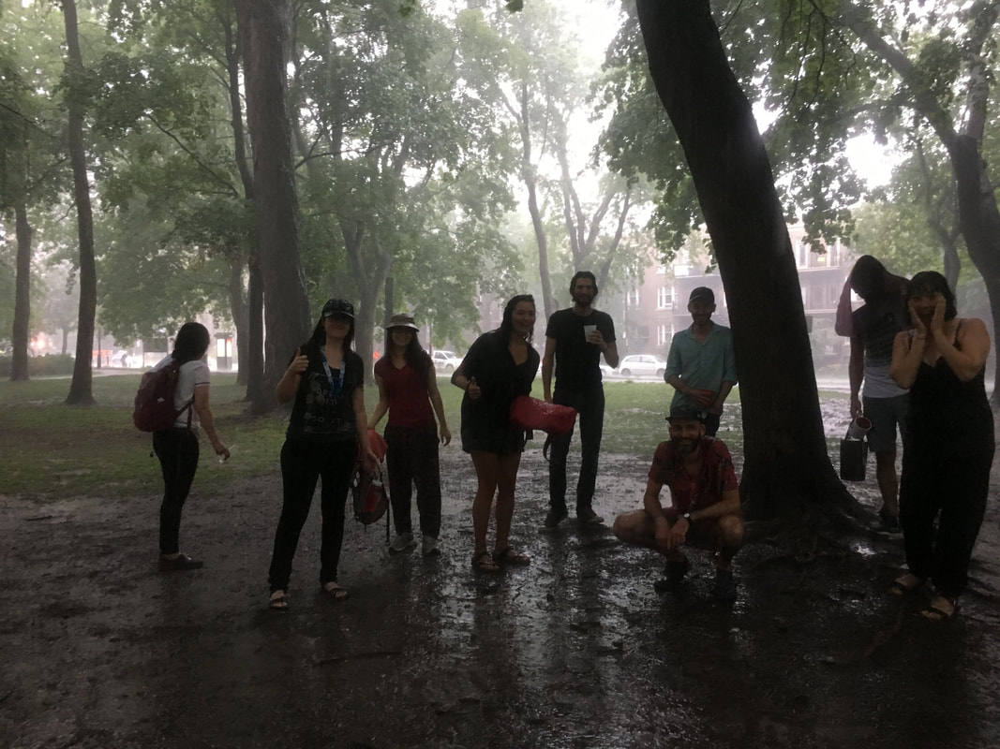
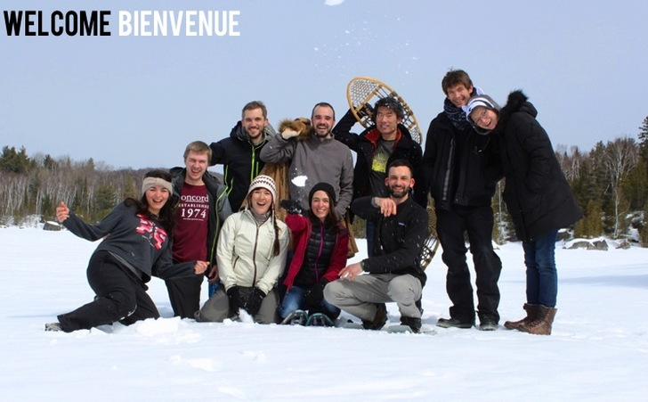

 
**News** - Summer 2025

1. Aline's paper "Phage predation is a biomarker for disease severity and shapes pathogen genetic diversity in cholera patients" is out in [Nature Comms](https://www.nature.com/articles/s41467-025-60699-0). Read Aline's [blog post](https://communities.springernature.com/posts/identifying-fused-chromosomes-in-vibrio-cholerae-o1) or a Bluesky thread [here](https://bsky.app/profile/bjesseshapiro.bsky.social/post/3lsvv6qi5ac2u).
2. Former postdocs Gavin Douglas and Nicolas Tromas have started their own labs, respectively at [UNB](https://www.unb.ca/faculty-staff/directory/science-fr-bio/douglas-gavin.html) and [INRAE](https://nicolastromascyano.weebly.com/). Check out their latest preprint [Co-occurrence drives horizontal gene transfer among marine prokaryotes](https://www.biorxiv.org/content/10.1101/2025.03.25.645238v1.abstract).
3. Akhil's first preprint [Nutrient Enrichment and Connectivity Jointly Shape Bacterioplankton Diversity](https://www.biorxiv.org/content/10.1101/2025.06.20.660555v1.abstract) is now out, in collaboration with the [LEAP](https://gault.mcgill.ca/en/news/detail/scientists-replicate-freshwater-ecosystems-to-detect-impacts-of-common-pesticides/) team!

**The lab is located at the [McGill Genome Centre](https://www.mcgillgenomecentre.ca/)** - Stop by and say hi! We have coffee.  

or you might also find us having a bbq or picnic. 
 
  
  
rain or shine...  

the lab circa 2014:
